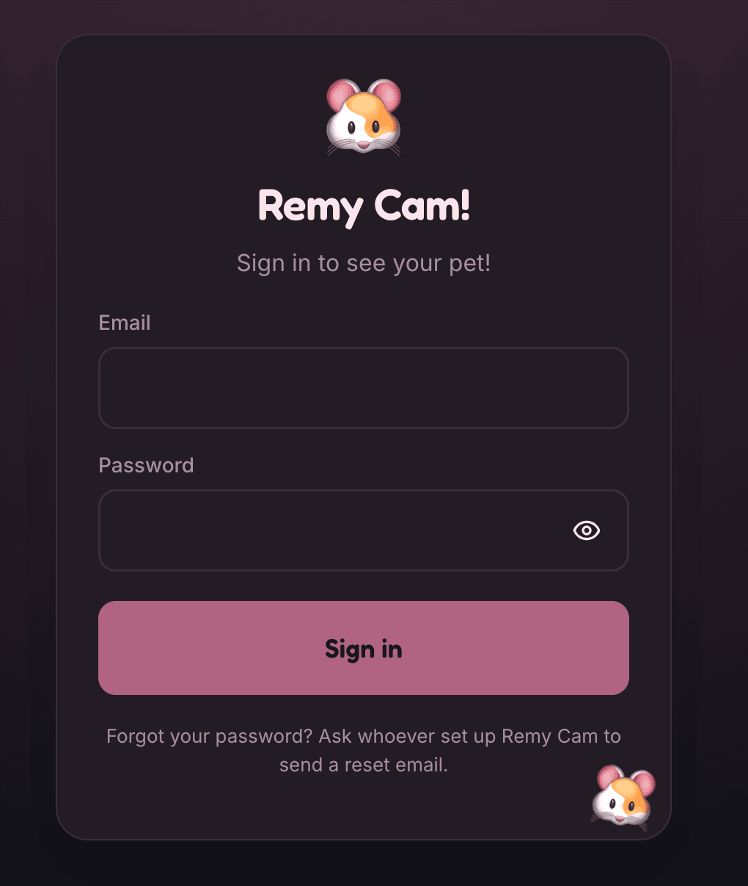
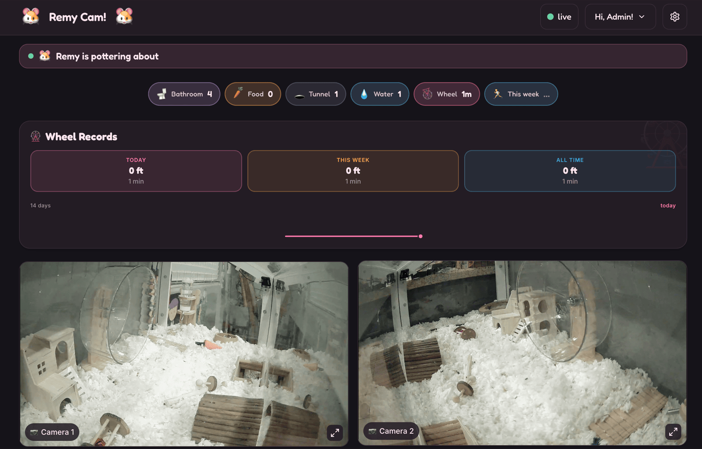
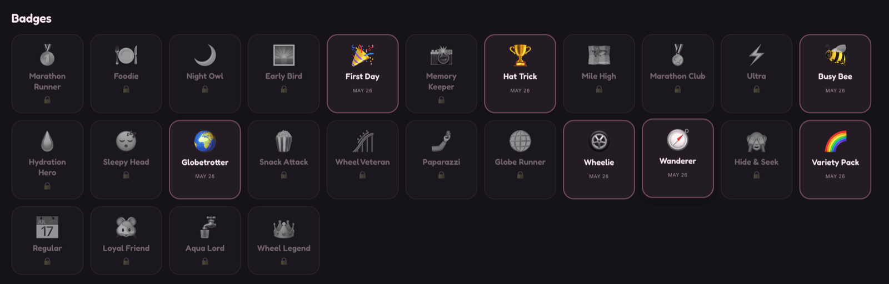
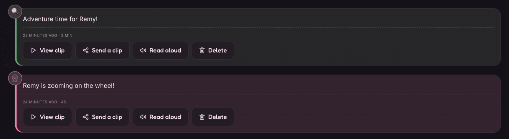
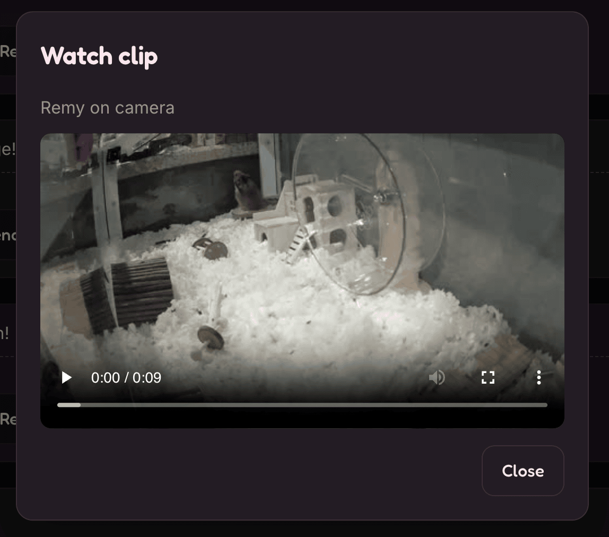

# remy-hamster

> A weekend-buildable, child-friendly pet camera. Cheap Pi-Zero cameras,
> on-device AI, a storybook activity diary, and a tiny AI ghostwriter
> that tucks your hamster in at night.

## The story

I built this for my daughter. She loves Remy, her hamster. Remy lives in
a cage in a room she's not always in. So we set out to give her a way to
peek in on him from anywhere — running on his wheel, sneaking a midnight
snack, curled up asleep — and to read a little diary of his day.

What started as "stick a webcam on a Pi" turned into a full self-hosted
multi-camera AI activity-tracking pet-cam, because that's what happens
when a dad with a Mac Mini and time on his hands gets enthusiastic. This
repo is the entire blueprint: hardware shopping list, configs, code, and
a step-by-step plan that takes a weekend.

If you build one, please send a photo.

## Table of contents

- [A look around](#a-look-around) — screenshots
- [What it does](#what-it-does) — feature tour
- [Who is this for?](#who-is-this-for)
- [Hardware shopping list](#hardware-shopping-list)
- [Quick start](#quick-start)
- [Run locally for UI review](#run-locally-for-uiux-review) — no Pis, no Frigate
- [Configuration & secrets](#configuration--secrets)
- [Optional features & how to enable them](#optional-features--how-to-enable-them)
- [Architecture](#architecture)
- [Tech stack](#tech-stack)
- [Customization](#customization)
- [Contributing](#contributing)
- [Authentication](#authentication--accounts)
- [Acknowledgments](#acknowledgments)
- [License](#license)

## A look around

The kid-friendly Login form — rendered by the app, no third-party redirect:



The camera grid dashboard with live multi-camera streaming:



Playful badges, earned automatically and tap-to-explain:



The storybook activity diary — each moment a torn-page card:



Recent diary cards carry a tap-to-play video clip pulled from Frigate:



## What it does

### Core

- **Live multi-camera streaming** from cheap WiFi-connected Pi Zero rigs
  (2 cameras shipped by default, scales out).
- **On-device AI activity detection** via Frigate + OpenVINO. Per-zone
  boxes flag wheel, food bowl, water, tunnel, hideaway, and more.
- **Kid-friendly storybook diary** translates raw events into prose:
  *"Remy went for a run on the wheel — 8 min!"*
  Each entry is a torn-page card with a soft watercolor tint, an
  auto-generated thumbnail, and — for recent moments — a tap-to-play
  video clip pulled straight from Frigate's recordings.
- **Playful badges** earned automatically: Night Owl, Marathon Runner,
  Foodie, Early Bird, Memory Keeper, Hat Trick — plus distance badges
  (Mile High Club, Marathon Club, Ultra) when the wheel odometer is on.
  Some badges repeat and carry a count; tap any badge to see what it
  represents.
- **Wheel odometer** *(optional, see below)*: stick a piece of dark
  tape on the wheel rim and the app counts rotations from the camera
  feed. The diary then says *"… ran on the wheel for 8 min · 0.27 mi"*
  and the stats strip shows today's and this week's distance and time.
- **One-tap snapshot button** saves the moment to a Memory Keeper feed.
- **Nightly recap video** stitches the night's snapshots into a
  ~60-second highlight reel that intelligently follows the camera where
  your pet was most active — no jarring camera-flipping — holding each
  frame a couple of seconds. Watermarked and tucked into the diary the
  next morning.

### Sharing & access

- **Self-hosted at your own domain** (`cam.remy-hamster.com`) with
  dynamic DNS, Let's Encrypt TLS, and a non-standard HTTPS port so
  Grandma can watch from her couch.
- **Zyphr.dev email/password sign-in** with role-based access.
  Our own kid-friendly Login form; the backend proxies credentials to
  Zyphr's API; Zyphr handles password storage, hashing, and rate-limiting.
- **Two roles:** `admin` manages everything, `child` sees cameras and
  the diary but never the Settings drawer.
- **Send-a-Clip:** share an individual diary card via email to a
  pre-approved recipient list.

### Whimsy & accessibility

- **Tablet-first**, 64-px tap targets, large readable type, dark mode.
- **Read-aloud TTS** on every diary card. Pre-readers tap the speaker
  icon and the browser narrates the storybook sentence. No backend, no
  cost, no tracking — pure `SpeechSynthesis`.
- **AI overnight storybook recap** *(optional, see below)*: every
  morning Google Gemini writes one warm paragraph summarizing the
  overnight hours. Kids wake up to a fresh recap pinned to the top of
  the morning diary, right beside the recap video.
- **Push notifications** *(optional, see below)*: rare-moment alerts
  — first-of-day, waking-up, long wheel runs — straight to your phone or
  tablet. Per-activity toggles, quiet hours, browser-native Web Push.
- **PWA install** with iOS/Android home-screen icons, splash screens,
  landscape lock, and offline shell.

## Who is this for?

- Parents who want to give a kid a magical window into their pet's world
- Tinkerers who like Pi Zeros, Docker Compose, and self-hosted everything
- Pet owners who already enjoy Frigate and want a cuddlier UI on top of it

You don't need to be a hamster owner. The whole UI is themable to any
pet — the onboarding wizard lets you pick a name, emoji, and color
palette, and the narrator ships defaults for hamsters, rabbits, cats,
dogs, parrots, lizards, fish, and turtles.

## Hardware shopping list

| Item                              | Qty | Approx. cost |
|-----------------------------------|-----|--------------|
| Raspberry Pi Zero 2 W             | 2   | $15 ea       |
| Arducam IMX462 USB low-light cam  | 2   | $35 ea       |
| 16 GB microSD card                | 2   | $6 ea        |
| USB-A → micro-USB OTG cable       | 2   | $4 ea        |
| 5 V 2.5 A power supply (micro-USB)| 2   | $8 ea        |
| Mac Mini (2018+, Intel)           | 1   | use what you have / ~$300 used |
| Coral USB Accelerator (optional)  | 1   | $60          |
| **Total (excluding Mac Mini)**    |     | **~$130**    |

The Mac Mini is the brain. Any always-on Linux box with an Intel iGPU
(for OpenVINO) or a Coral USB stick will work — a NUC, an old laptop,
even a beefier Raspberry Pi 5 with a Coral.

### Alternative: one Pi 5 / Pi 4 / Pi 3 B+ instead of two Pi Zero 2 W's

If your cameras sit within ~3 ft of each other you can consolidate to a
**single more capable Pi** hosting both USB cameras. Trade-offs:

- Wins: 5 GHz WiFi (or wired Ethernet) eliminates the 2.4 GHz
  channel-contention pattern that bites Pi Zero W's hard; proper USB
  host controllers replace the Pi Zero's OTG-mode workarounds; one
  device to admin instead of two.
- Costs: single point of failure; **Pi 5 specifically has no hardware
  H264 encoder** so it software-encodes (manageable on the quad A76);
  one bad USB camera can affect the other via shared bus.
- Recommended choice for the role: **Pi 4 (8 GB)** — value sweet spot,
  has the hardware H264 encoder Pi 5 lost. Pi 5 if you want WiFi 6 and
  future NPU/Coral headroom. Pi 3 B+ if you have one lying around.

Bring-up steps and a board comparison table are in
[`docs/SETUP_PI_HOST.md`](docs/SETUP_PI_HOST.md). The Mac Mini side
collapses to a single hostname with two RTSP paths.

## Quick start

Roughly four hours spread across an evening or two. The TL;DR:

1. **Flash Ubuntu Server** onto the Mac Mini, install Docker.
2. **Flash two Pi Zero 2 Ws** as RTSP camera servers (go2rtc + H264
   hardware encode via VideoCore IV). See [`docs/SETUP_PI_ZERO.md`](docs/SETUP_PI_ZERO.md).
3. **Copy `.env.example` to `.env`** on the Mac Mini and fill it in.
4. **Copy `mac-mini/frigate-config.example.yml` to
   `mac-mini/frigate-config.yml`** and tweak it for your setup (camera
   stream names, the Mac Mini's WebRTC LAN IP, zones, masks). The real
   file is gitignored and host-authoritative — see the *Configuration &
   secrets* section below.
5. From your dev machine: `./deploy.sh` — cross-builds the linux/amd64
   app image, ships it to the Mini over SSH, and brings up the full
   Docker Compose stack (Mosquitto, Frigate, Caddy, hamster-app). No
   host Node or pnpm required on the Mini.
6. **Configure Frigate:** point it at your Pi RTSP streams, define zones
   (wheel, food, water…) in the Frigate UI.
7. **Set up DDNS + Caddy + auth.** Forward the non-standard HTTPS port
   at your router (`CADDY_HTTPS_PORT`, default `2053`, TCP **and** UDP
   for HTTP/3). Add a Cloudflare Origin Rule that maps edge `:443` →
   origin `:2053` so visitors use the clean URL.
8. **Open the URL on a tablet**, run the onboarding wizard, done.

Detailed Mac Mini and Pi setup guides:
- [`docs/SETUP_MAC_MINI.md`](docs/SETUP_MAC_MINI.md)
- [`docs/SETUP_PI_ZERO.md`](docs/SETUP_PI_ZERO.md) — dual Pi Zero 2 W, one per camera (the standard build)
- [`docs/SETUP_PI_HOST.md`](docs/SETUP_PI_HOST.md) — single Pi 5 / Pi 4 / Pi 3 B+ hosting both cameras (alternative)

## Run locally for UI/UX review

For poking the UI without provisioning Pis, Frigate, or a real Zyphr
tenant. One command from the repo root runs both halves in parallel
with prefixed output:

```sh
pnpm install
pnpm dev
```

If you'd rather drive the workspaces independently (e.g. restart just
the backend), use two terminals: `pnpm -F server dev` and `pnpm -F web dev`.

Open <http://localhost:5181> and sign in:

- **Email:** `dev@hamster.local`
- **Password:** `hunterhunter`

The Today feed lands pre-populated with wheel / food / water / bathroom
/ transition / resting / exploring entries so every diary card variant
renders on first load.

State persists at `<repo>/.dev/` (SQLite + storage); `rm -rf .dev`
resets to factory defaults.

**Ports.** Backend defaults to **5180**, web to **5181**. Override:

```sh
HC_BACKEND_PORT=5274 HC_WEB_PORT=5174 pnpm dev
```

**Other overrides** (all optional): `HC_DEV_EMAIL`, `HC_DEV_PASSWORD`,
`HC_DEV_DISPLAY_NAME`, `HC_DEV_PET_NAME`, `HC_DEV_SANDBOX`,
`DATABASE_PATH`, `STORAGE_PATH`.

**What's missing vs. production.** No MQTT (so no live diary updates
from Frigate events), no real camera streams (the seeded cameras have
placeholder RTSP URLs), no real Zyphr (the in-process stub accepts the
seeded password only). For end-to-end auth/network testing against
your real Zyphr tenant, use `pnpm -F server dev:raw` with your own
`.env`.

## Configuration & secrets

Everything the stack reads comes from a single `.env` file on the Mac
Mini at `/opt/hamster-cam/.env` (chmod 600, owned by the app user). A
fully-commented [`.env.example`](.env.example) lives at the repo root
— `cp .env.example .env` and fill in the placeholders.

### Accounts you need to create

| Service | What you need | Where to get it |
|---|---|---|
| **Zyphr.dev** *(required)* | An account + an application + a server-side API key (`zy_live_…`) | [zyphr.dev](https://zyphr.dev) → dashboard → API Keys |
| **Cloudflare** *(required)* | An account + a registered domain on Cloudflare DNS + a scoped API token | [dash.cloudflare.com](https://dash.cloudflare.com) → My Profile → API Tokens → *Create Token* with `Zone : DNS : Edit` scoped to your one zone |
| **Google AI Studio** *(optional — only for the AI nightly recap)* | A Gemini API key (free tier is enough) | [aistudio.google.com](https://aistudio.google.com/app/apikey) → *Create API key* |

### Environment variables at a glance

This table mirrors [`.env.example`](.env.example). If a variable is
listed there it's listed here and vice versa.

| Variable | Purpose | Notes |
|---|---|---|
| `ZYPHR_API_KEY` | Authenticates the backend against Zyphr's API | Format `zy_live_…`. Required. |
| `ZYPHR_APP_SECRET` | Zyphr application secret (paired with `ZYPHR_API_KEY`) | Must be from the same Zyphr environment as the key. Required. |
| `ZYPHR_BASE_URL` | Override the Zyphr API host | *Optional.* Defaults to `https://api.zyphr.dev/v1`. |
| `ZYPHR_FROM_EMAIL` | Sender address for Zyphr-delivered emails | Used by Send-a-Clip and disk-critical alerts. |
| `CLOUDFLARE_API_TOKEN` | DDNS + DNS-01 cert issuance | Scoped: `Zone : DNS : Edit` on one zone only. |
| `CLOUDFLARE_ZONE` | Your apex domain | e.g. `remy-hamster.com`. |
| `CLOUDFLARE_SUBDOMAIN` | The subdomain the cam runs at | e.g. `cam` → `cam.remy-hamster.com`. |
| `GEMINI_API_KEY` | Enables the nightly AI storybook recap | **Optional.** If unset the recap job logs `skipped: no_api_key` and exits cleanly. Free at [aistudio.google.com](https://aistudio.google.com/app/apikey). |
| `GEMINI_MODEL` | Which Gemini model writes the recap | *Optional.* Defaults to `gemini-2.5-flash`. |
| `RTSP_USERNAME` / `RTSP_PASSWORD` | Locks the go2rtc RTSP listener on each Pi | Generate password with `openssl rand -base64 24`. |
| `FRIGATE_RTSP_PASSWORD` | What Frigate sends to the Pi Zeros | Must equal `RTSP_PASSWORD`. |
| `MQTT_URL` | Mosquitto connection string for the backend | `mqtt://mosquitto:1883` (Docker DNS, compose network). |
| `MQTT_USERNAME` / `MQTT_PASSWORD` | Mosquitto credentials | Same values used by Frigate and the backend. |
| `FRIGATE_URL` | Where the backend reaches Frigate | `http://frigate:5000` (Docker DNS, compose network). |
| `PORT` | Fastify listen port | Defaults to `3000`. |
| `DATABASE_PATH` | SQLite file location | e.g. `/opt/hamster-cam/db/hamster.db`. |
| `STORAGE_PATH` | Snapshots + time-lapse MP4s | e.g. `/opt/hamster-cam/storage`. |
| `WEB_DIST_PATH` | Absolute path to built React SPA inside the container | Set to `/app/web/dist` in the compose env block. |
| `PUBLIC_URL` | Public HTTPS origin for the live-view WS proxy allowlist | e.g. `https://cam.remy-hamster.com`. Required in production. |
| `SESSION_TTL_DAYS` | Session cookie lifetime | Defaults to `30`. |
| `HOST_UID` / `HOST_GID` | UID/GID for the container's bind-mounted dirs | Set to the Mac Mini deploy user's `id -u` / `id -g` (default `1000:1000`). |
| `CADDY_HTTPS_PORT` | Non-standard HTTPS port at the firewall | Defaults to `2053`. Must be one of Cloudflare's proxied ports. |
| `CADDY_EMAIL` | Let's Encrypt account contact | For cert expiry notifications. |
| `CADDY_HOSTNAME` | The FQDN you serve at | e.g. `cam.remy-hamster.com`. |
| `MAC_MINI_HOST` / `MAC_MINI_USER` / `MAC_MINI_PATH` | SSH target for `deploy.sh` | Dev-machine-side only. |
| `TZ` | Container timezone | IANA name, defaults to `Etc/UTC`. |

### Per-Pi-Zero secrets

Each Pi also needs a tiny env file at `/etc/go2rtc/go2rtc.env` (chmod
600, root-owned) containing only the RTSP password:

```sh
RTSP_PASSWORD=<same value as the Mac Mini's .env>
```

The shipped `go2rtc.service` references it via `EnvironmentFile=`, so
go2rtc reads the password at boot without it ever appearing on a
command line or in `/proc`.

### Frigate config (`frigate-config.yml`)

Frigate's config is treated the same way as `.env`: the real file
(`mac-mini/frigate-config.yml`) is **gitignored**, and an annotated
template ([`mac-mini/frigate-config.example.yml`](mac-mini/frigate-config.example.yml))
ships in the repo. Seed it once:

```sh
cp mac-mini/frigate-config.example.yml mac-mini/frigate-config.yml
```

Then edit the new file for **your** setup — at minimum:

- **`go2rtc.webrtc.candidates`** — set this to the Mac Mini's LAN IP
  so WebRTC live view works (otherwise the player falls back to MSE).
- **`go2rtc.streams`** — one entry per Pi Zero, using your DHCP-
  reserved hostnames / IPs.
- **`cameras.<name>.zones`** — draw boxes in Frigate's web zone
  editor and paste the generated coordinates here (the zone *name*
  picks the diary activity; see
  [`docs/SETUP_MAC_MINI.md`](docs/SETUP_MAC_MINI.md) Step 8.5 for the
  full keyword table).

The file is **host-authoritative** — Frigate's zone editor writes
coordinates back into the Mini's copy, and operator-tuned object masks
accumulate there over time. `deploy.sh` deliberately does not overwrite
it on a normal deploy; pass `--sync-frigate-config` to push your local
copy (and the script backs up the remote one first).

### What's NOT in `.env`

- **Admin account credentials.** The first admin is created via the
  bootstrap CLI run inside the running container on the Mac Mini, then
  every subsequent account is admin-created from Settings → Users. No
  default password is ever baked in.
- **Pet name, camera URLs, theme, notification preferences, wheel
  odometer config, distance unit.** Stored in the SQLite `settings`,
  `cameras`, and `notification_preferences` tables — configured
  through the UI.

> **Never commit `.env` or `frigate-config.yml`.** Both are listed in
> the repo's root `.gitignore`. Commit changes to `.env.example` and
> `frigate-config.example.yml` instead so contributors see what's
> expected without leaking your secrets, LAN topology, or pet-specific
> tuning.

## Optional features & how to enable them

Every optional feature has a safety gate: if the configuration is
missing, the feature stays silent and the rest of the app keeps
working. Nothing crashes the server.

### AI overnight storybook recap (Google Gemini)

**What it does.** Every morning at 06:10 local, the backend reads the
diary entries from the overnight window (9pm–6am) and asks Gemini to
write one warm 2–4 sentence storybook paragraph. The result lands as a
`recap` diary entry pinned to the top of the morning feed, beside the
night recap video — kids wake up to a fresh recap of what their pet got
up to overnight.

> *"Remy had a busy night! He ran on his wheel for fourteen minutes,
> visited the food bowl four times, and finished the morning curled
> up in his cozy nest. A very small fuzzy adventurer."*

**How to enable.**
1. Get a free API key from [aistudio.google.com/app/apikey](https://aistudio.google.com/app/apikey).
   Sign in with a Google account, click *Create API key*, copy it.
2. Add to your `.env`:
   ```sh
   GEMINI_API_KEY=AIzaSyA...your-key-here
   GEMINI_MODEL=gemini-2.5-flash
   ```
3. Restart the backend (`docker compose restart hamster-app`).

**Cost.** Gemini 2.5 Flash's free tier gives generous daily request
limits. This app uses one request per night. You will never approach
the limit.

**If the key is missing or revoked,** the recap job logs and exits
cleanly. Every other feature keeps working.

### Read-aloud TTS

**What it does.** A speaker icon appears on every diary card. Tap it
and your browser speaks the storybook sentence aloud — useful for
pre-readers and for accessibility. Re-tap to stop. The voice picks
itself from your OS's installed speech synths, biased toward
child-friendly English voices.

**How to enable.** Already on. Toggle off in Settings → Pet → "Read
diary aloud" if you'd rather have silent cards.

**Privacy.** Uses your browser's built-in `SpeechSynthesis` API. No
backend call, no audio leaves the device, no cost.

### Push notifications

**What it does.** Subscribes your tablet or phone to native Web Push
notifications. By default you'll get a notification only on **rare
moments**: the first wheel run of the day, your pet waking up after a
quiet stretch, an extra-long wheel session. Quiet hours (default
9pm–7am) suppress everything.

**How to enable.**
1. Open the app on the device you want notified, log in.
2. Settings → Notifications → toggle "Send me notifications on this
   device" → grant the browser permission prompt.
3. Customize per-activity toggles, rare-only mode, and quiet hours.
4. Hit "Send test notification" to verify.

**iOS PWA caveat.** iOS only delivers push to PWAs that have been
*Added to Home Screen*. The Notifications tab calls this out when it
detects an iOS browser that isn't running standalone.

**VAPID keys** are generated on first boot and stored in the SQLite
`settings` table — you don't need to configure anything in `.env`.

### Wheel odometer — counting rotations & distance

**What it does.** Counts real wheel rotations *optically* and converts them to
distance. You put one high-contrast mark on the wheel rim; the backend watches a
small box of the camera frame where that mark passes and counts each
pass as one rotation. Distance is just circumference × rotations:

```
metres = rotations × π × wheel_diameter_mm ÷ 1000
```

The narrator attaches each session's distance to that wheel diary entry; the
StatsStrip shows today's and this week's distance and time (in your chosen
units); and three lifetime badges unlock at 1 mile, a marathon, and 100 miles.

**How the counting works.** When the hamster enters the **wheel zone** (so that
zone must be drawn — see [SETUP_MAC_MINI §8.5](./docs/SETUP_MAC_MINI.md)), the
backend opens a session: samples the camera feed at 10 fps, crops to a small
detection box you position over the spot where the tape passes, counts the dark
pixels inside it, and runs a debounced state machine — `LIGHT → DARK` (mark
entered the box) `→ LIGHT` (mark left) = **one rotation** (an 80 ms / 3-frame
debounce rejects flicker). When the hamster leaves the wheel the session closes
and the distance lands on the diary entry. Sessions auto-stop after 2 h.

**Requirements.** A camera the backend can reach and `ffmpeg` (bundled in the
app container). Both are in place out of the box.

**Setup.**
1. **Mark the wheel** — ~1–2 cm of dark gaffer/electrical tape (or a Sharpie
   blob) on the rim, one high-contrast mark. The only physical change.
2. **Draw the wheel zone** for that camera (SETUP_MAC_MINI §8.5) — sessions
   trigger on wheel-zone entry.
3. Settings → Cameras → the wheel camera → **Wheel odometer**.
4. Toggle **Enable wheel odometer** on.
5. **Wheel diameter (mm)** — match your wheel (default 152 = 6"; measure the
   outer rim — this is what converts rotations to distance).
6. **Detection box** — position and size the box (X / width %, Y / height %)
   over the small arc of rim where the tape passes once per turn. Keep it small
   so only the tape darkens it.
7. **Dark threshold (%)** (default 50) — the box reads "mark present" when it's
   darker than `255 × (1 − threshold/100)`.
8. **Test detection** — grabs one frame, shows the cropped box + its dark-pixel
   ratio. With the tape sitting in the box the ratio should jump above the
   threshold ("Tape visible"); without it, stay low. Tune the box/threshold until
   that's clean, then **Save**. From the next wheel session, diary cards carry a
   distance note and the StatsStrip distance climbs.

**Privacy / cost.** Zero — detection runs locally against the camera feed; no
frames leave your network. **Per camera, off by default** — disabled cameras are
silent and the diary still works without distance numbers.

### Send-a-Clip email sharing

**What it does.** A "Send a clip" button on every diary card lets you
email the entry to a pre-approved recipient (Grandma's email, your
partner, etc.) via Zyphr's messaging API.

**How to enable.** Set `ZYPHR_FROM_EMAIL` in `.env` and verify the
sending domain in your Zyphr dashboard. Recipients are managed from
Settings → Sharing.

**If `ZYPHR_FROM_EMAIL` is missing,** the share button still renders
but the send action returns an error — no app crash.

## Architecture

```
[Cage room]                          [Mac Mini — Ubuntu Server]
                                      ┌──────────────────────────────┐
2× IMX462 USB cam                     │  Docker Compose stack        │
    │                                 │                              │
    ▼                                 │  ┌─────────────────────────┐ │
Pi Zero 2 W ─────────────────────────►│  │ frigate (0.17)          │ │
  VideoCore IV H264 encode            │  │  embedded go2rtc        │ │
  ffmpeg -c:v h264_v4l2m2m            │  │  ├── pulls RTSP once/Pi │ │
  720p ~3 Mbps MPEG-TS to go2rtc     │  │  ├── relays to detect   │ │
  go2rtc serves RTSP on :8554         │  │  ├── relays to record   │ │
                                      │  │  └── relays to browser  │ │
Pi Zero 2 W ─────────────────────────►│  │  OpenVINO inference     │ │
  (same setup)                        │  │  (Intel UHD 630 iGPU)   │ │
                                      │  └─────────────────────────┘ │
                                      │  ┌──────────────┐            │
                                      │  │ mosquitto    │ MQTT 1883  │
                                      │  └──────────────┘            │
                                      │  ┌──────────────────────────┐│
                                      │  │ hamster-app container    ││
                                      │  │  Fastify + tRPC          ││
                                      │  │  SQLite (./db bind-mount)││
                                      │  │  MQTT subscriber         ││
                                      │  │  /live/ws WS proxy       ││ ← auth-gated
                                      │  │  Cron: snapshots */2 22-6││
                                      │  │  Cron: timelapse 06:05   ││
                                      │  │  Cron: recap* 06:10      ││
                                      │  │  Cron: retention 02:00   ││
                                      │  │  Cron: disk-watch 03:00  ││
                                      │  │  Cron: thumb-backfill */3││
                                      │  │  React SPA served here   ││
                                      │  └──────────────────────────┘│
                                      │  ┌──────────────┐            │
                                      │  │ caddy        │ :2053 TLS  │
                                      │  │ Cloudflare   │ DDNS       │
                                      │  │ DNS-01 cert  │            │
                                      │  └──────────────┘            │
                                      └──────────────────────────────┘
                                                   ↑
                                         Daughter's tablet / browser
                                         Cloudflare CDN maps :443 → :2053
                                         LAN: WebRTC (UDP :8555, ~sub-second)
                                         Remote: MSE over WSS/Cloudflare

                                      * recap: optional, skips without GEMINI_API_KEY
```

### Live-view data flow

Each Pi Zero hardware-encodes H264 on its VideoCore IV block
(`ffmpeg -c:v h264_v4l2m2m`, 720p, ~3 Mbps), pipes it as MPEG-TS to
go2rtc, and go2rtc serves the stream over RTSP on port 8554.

Frigate's embedded go2rtc pulls each Pi exactly once over WiFi.
From that single pull it fans out to all consumers — detect, record,
and live view — without transcoding. The Mac Mini's iGPU is used
only for OpenVINO object detection.

The browser live view connects to the backend's
`GET /live/ws?src=<stream-name>` — an authenticated WebSocket endpoint
that verifies the `__Host-session` cookie and allows only configured
camera stream names, then reverse-proxies the connection to Frigate's
embedded go2rtc at `http://frigate:5000/api/go2rtc/api/ws?src=<name>`.

On the LAN the player negotiates WebRTC (UDP media direct to port 8555,
sub-second latency). Over Cloudflare it falls back to MSE — Cloudflare
is an HTTP/HTTPS proxy and cannot relay WebRTC UDP. No TURN server is
needed; the MSE path rides the existing HTTPS/WSS connection through
Caddy, which is already near-realtime.

Each camera is identified in the app by its **go2rtc stream name**
(e.g. `hamster_cam_1`). Configure this in Settings → Cameras as the
"Live source" field; use the Discover button to see all names reported
by go2rtc.

## Tech stack

- **Edge:** Raspberry Pi Zero 2 W + Arducam IMX462 USB camera + go2rtc.
  Each Pi captures MJPEG from the camera and hardware-encodes H264 on
  the VideoCore IV block (`ffmpeg -c:v h264_v4l2m2m`, 720p, ~3 Mbps),
  pipes it as MPEG-TS to go2rtc, which serves it over RTSP. WiFi
  power-save disabled; go2rtc + a watchdog run as systemd units.
- **NVR + detection:** Frigate 0.17 with OpenVINO accelerated inference
  on the Intel UHD 630 iGPU. Embedded go2rtc pulls each Pi's H264 once
  and relays it (copy, no transcode) to the browser live view and
  to Frigate's own detect + record pipelines.
- **Live view:** go2rtc auto-negotiating player (WebRTC on LAN, MSE
  over Cloudflare); authenticated `GET /live/ws` WS proxy in the
  backend; camera identified by go2rtc stream name (`live_src`).
- **Messaging:** Mosquitto MQTT (Frigate's event bus).
- **App backend:** Fastify + tRPC + better-sqlite3 + MQTT subscriber
  + `web-push` for Web Push fan-out + Google Gemini for the nightly
  storybook recap; runs as Docker container `hamster-cam/app:local`
  (cross-built linux/amd64 on the arm64 dev machine via `docker buildx`
  + QEMU; shipped to the Mini with `docker save | gzip | ssh | docker load`;
  no registry, no host Node/pnpm required). Non-root, hardened
  container (cap_drop ALL, no-new-privileges, read-only rootfs + tmpfs).
- **App frontend:** Vite + React + TypeScript + Framer Motion + Radix UI.
- **PWA:** vite-plugin-pwa with a small hand-rolled push/notificationclick
  service worker (`public/sw-push.js`).
- **Transport:** Cloudflare DDNS + Caddy reverse proxy with Let's
  Encrypt TLS (DNS-01 via Cloudflare) on a non-standard port (2053).
- **Auth:** [Zyphr.dev](https://zyphr.dev) via the official
  `@zyphr-dev/node-sdk`; our own Login form (no Zyphr-hosted page);
  opaque server-side sessions in SQLite with HttpOnly `__Host-session`
  cookie; two roles (`admin` / `child`) enforced server-side.
- **Host OS:** Ubuntu Server 24.04 LTS on a Mac Mini.
- **Deploy:** `docker buildx` cross-build on the dev machine → pipe
  over SSH → `docker compose up -d` on the Mini. No registry, no build
  on the host, no host Node/pnpm.

## Authentication & accounts

The Login form is **rendered by our app** and matches the rest of the
kid-friendly UI — no redirect to a third-party hosted page. Submitting
the form POSTs `{ email, password }` to our backend, which proxies to
[**Zyphr.dev**](https://zyphr.dev)'s `POST /auth/login` API. Zyphr
handles password storage, hashing, and rate-limiting; our backend
handles authorization (role checks against a local mirror) and issues
an opaque HttpOnly session cookie.

**Two roles** live in the app's local mirror:

- **`admin`** — full access. Manages cameras, pet settings, every
  account (create, trigger password reset, delete), and notification
  preferences from a six-tab Settings drawer (Pet, Cameras, Users,
  Audit, Sharing, Notifications). Account creation calls
  Zyphr's `/auth/register`; password reset triggers `/auth/password/forgot`.
- **`child`** — view-only. Sees cameras, the diary, badges, and
  snapshots. **No Settings, no gear icon.** Password changes are
  admin-driven via the email reset flow.

**No public sign-up.** New accounts are admin-created from inside the
app. The very first admin is created with a one-time CLI command run
inside the running container on the Mac Mini:

```sh
docker compose exec hamster-app node dist/bootstrap.js \
  --email you@example.com --display-name "Dad" \
  --password "$(openssl rand -base64 24)"
```

No default password is ever baked into the image.

Error-handling surfaces `ZyphrAuthenticationError`,
`ZyphrRateLimitError`, etc., and role checks happen server-side
before every protected tRPC procedure.

## Customization

Not a hamster person? Change the pet emoji and palette in the
onboarding wizard. Add, remove, or temporarily hide cameras at any
time from Settings → Cameras — a one-tap per-camera toggle drops a
camera from the live grid while keeping its diary history intact.
Tweak the narrative templates in
`app/server/src/narratives.ts` to match your pet's vibe — we've shipped
defaults for hamsters, rabbits, cats, dogs, parrots, lizards, fish,
and turtles.

## Contributing

PRs welcome, especially:

- Additional pet-themed narrative packs (bunny, hedgehog, gecko, …)
- New badges
- Hardware variant guides (Raspberry Pi 5, NUC, Coral-only setups)
- Translations of the diary templates

Open an issue or PR with a short description of what you built and why.

## Acknowledgments

This project stands on the shoulders of giants:

- [**Frigate**](https://frigate.video) — the NVR doing all the heavy
  lifting
- [**go2rtc**](https://github.com/AlexxIT/go2rtc) — the magic that
  turns $35 USB cameras into low-latency WebRTC streams
- [**Zyphr.dev**](https://zyphr.dev) — email/password auth-as-a-service
  so we render our own Login UI but never store a single password
- [**Caddy**](https://caddyserver.com) — automatic TLS that just works
- [**Google Gemini**](https://aistudio.google.com) — the tiny
  ghostwriter for the nightly storybook recap
- [**t2linux**](https://wiki.t2linux.org) — getting Ubuntu onto an
  Intel Mac Mini's T2 chip is solved because of these heroes

And of course Remy, the hamster who unknowingly volunteered for QA.

## License

[MIT](LICENSE) © 2026 Aaron Coppock — go forth and build pet cams.
